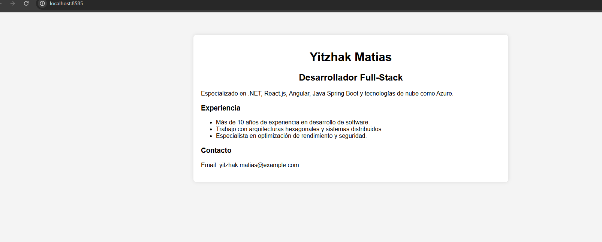
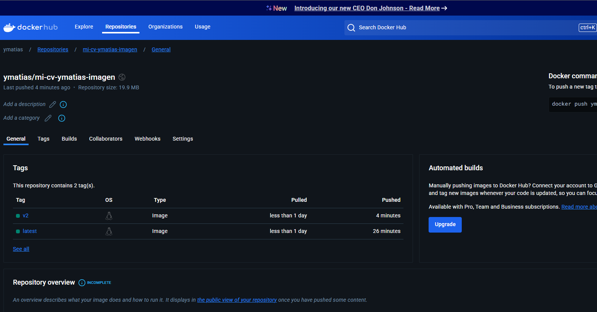

# Proyecto: Despliegue de una Página Web con Docker

Este proyecto contiene una imagen Docker para desplegar una página web estática (Hoja de Vida) usando **Nginx**. La imagen se construye a partir de un archivo **Dockerfile** que incluye varios archivos estáticos como `index.html` y otros archivos relevantes.

## Contenido

1. [Requisitos](#requisitos)
2. [Estructura del Proyecto](#estructura-del-proyecto)
3. [Ver la Página Web](#ver-la-página-web)
4. [Capturas de Pantalla](#capturas-de-pantalla)
5. [Docker Hub](#Docker-hub)

## Requisitos

- Tener **Docker** instalado en tu máquina.
- Tener una cuenta en **Docker Hub** para subir la imagen.

## Estructura del Proyecto

El proyecto incluye los siguientes archivos:

- **Dockerfile**: Define cómo construir la imagen Docker.
- **index.html**: Archivo principal de la página web (Hoja de Vida).
- **Readme.md**: Archivo adicional que se incluye en el contenedor.
- Otros archivos estáticos.

La estructura del proyecto es la siguiente:
```plaintext
mi-cv/
├── Dockerfile
├── index.html
├── Readme.md
└── img.png
└── img_1.png
```
## Ver la Página Web 
```http request
http://localhost:8585/
```


## Docker Hub
``` https://hub.docker.com/r/ymatias/mi-cv-ymatias-imagen/tags ```
## Capturas de Pantalla




